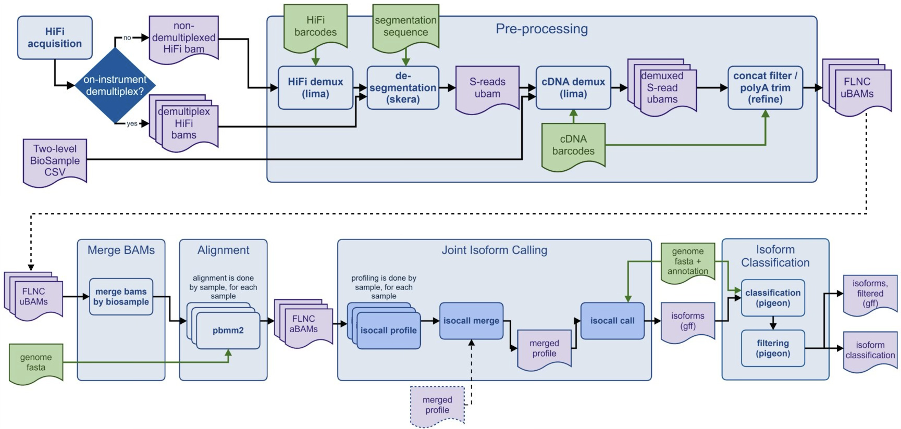

<h1 align="center">PacBio Kinnex Iso-Seq Pipeline</h1>

> [!WARNING]
> **BETA:** This workflow is under active development. Interfaces, defaults,
> runtime behavior, and output bundles may change in wide-sweeping ways; use
> tagged releases for reproducible testing.

Workflow for analyzing human PacBio Kinnex Iso-Seq sequencing data using
[Workflow Description Language (WDL)](https://openwdl.org/).

- Docker images used by this workflow are defined in [the wdl-dockerfiles repo](https://github.com/PacificBiosciences/wdl-dockerfiles). Images are hosted in PacBio's [quay.io repository](https://quay.io/organization/pacbio).
- Task container images are selected in WDL runtime blocks and documented in the [tools and containers](docs/tools_containers.md) documentation.
- Reusable GRCh38 and Kinnex resources can be supplied through an immutable [reference container or typed file overrides](docs/reference_container.md).
- User-facing workflow entrypoints live in the [workflows directory](workflows).

## Workflow

This repository exposes three user-facing workflows:

The `kinnex_isoseq` workflow is designed for end-to-end analysis of Kinnex
Isoseq HiFi data. It takes as input HiFi bams from a single acquisition and
produces classified, filtered isoforms.

The `preprocessing` workflow is design to generate transcript BAMs, also known
as FLNC BAMs, from Kinnex HiFi data. It takes as input HiFi bams from a single
acquisition and generates sample-annotated transcript BAMs which contain poly-A
trimmed, 5' -> 3' transcript sequences.

The `secondary_analysis` workflow takes a set of sample-annotated transcript
BAMs, from any number of acquisitions. It produces classified, filtered isoform
for each sample, as annotated in the BAM header. If multiple BAMs are provided
for a sample, they are merged.

|  |
| :---: |

**Workflow entrypoints**:

- [End-to-end HiFi BAM workflow](workflows/kinnex_isoseq.wdl)
- [Preprocessing workflow](workflows/preprocessing.wdl)
- [FLNC-level secondary analysis workflow](workflows/secondary_analysis.wdl)

## Quick start guide

In this section, we describe a quick way to get started with:

- `miniwdl` as the workflow engine,
- `slurm HPC` as the backend,
- `apptainer` as the container run time,
- the PacBio provided human reference data bundle,
- an instrument acquisition which was not demultiplexed on-instrument.

### Setup

- Clone this repository

```bash
git clone git@github.com:PacificBiosciences/Kinnex-IsoSeq-WDL.git
cd Kinnex-IsoSeq-WDL
```

- Install [miniwdl](docs/backend-hpc.md#miniwdl)
- Install [apptainer](https://apptainer.org/docs/admin/main/installation.html#install-from-pre-built-packages)
- Obtain the immutable reference-container URI published for this workflow
  release and ensure compute nodes can authenticate to its registry.

### Fill out your inputs.json

Copy the `no_instrument_demux` kinnex_isoseq template:
[inputs.json](backends/hpc/kinnex_isoseq.no_instrument_demux.hpc.inputs.json)
and the adjacent example
[biosamples.example.csv](backends/hpc/biosamples.example.csv).

Place the copied sample sheet at
`<local_path_prefix>/samples/biosamples.csv`, or update the `biosample_csv`
input to its location. Replace every `<local_path_prefix>` placeholder with
paths visible to the workflow jobs, and edit the sample sheet to describe the
barcode and sample assignments for your run.

### Run the workflow

```bash
miniwdl run --cfg ~/.config/miniwdl.cfg \
  -i kinnex_isoseq.no_instrument_demux.hpc.inputs.json \
  workflows/kinnex_isoseq.wdl
```

## Beyond quick start

1. [Select a backend environment](#selecting-a-backend)
2. [Configure a workflow execution engine and container runtime](#configuring-a-workflow-engine-and-container-runtime)
3. [Set up your reference resources](#setting-up-your-reference-resources)
4. [Fill out the inputs JSON file for your run](#filling-out-the-inputs-json)
5. [Run the workflow](#running-the-workflow)

### Selecting a backend

The currently supported public backend target is Slurm HPC. We provide
maintained example configurations for running the workflow with miniwdl through
miniwdl-slurm, and with Sprocket with its Slurm/Apptainer backend. Cromwell
can use the same WDL entrypoints and HPC input templates, but this repository
does not provide a Cromwell backend configuration.

| Backend | Status | Documentation |
| :- | :- | :- |
| HPC | Supported on Slurm with miniwdl, Sprocket, or Cromwell | [HPC backend guide](docs/backend-hpc.md) |
| AWS HealthOmics | No maintained template | Not currently provided |
| Azure | No maintained template | Not currently provided |
| GCP | No maintained template | Not currently provided |

### Configuring a workflow engine and container runtime

An execution engine is required to run WDL workflows. For the supported public
HPC path, install [`miniwdl`](https://miniwdl.readthedocs.io/en/latest/) with
[`miniwdl-slurm`](https://github.com/miniwdl-ext/miniwdl-slurm),
[`sprocket`](https://github.com/stjude-rust-labs/sprocket), or [`Cromwell`](https://cromwell.readthedocs.io/en/stable/backends/Backends/).
Make sure Slurm commands and a Singularity-compatible container runtime are available
on the submit host and cluster nodes. See the [HPC backend guide](docs/backend-hpc.md)
for setup details.

### Setting up your reference resources

The simplest public path supplies `reference_container`: a complete OCI image
URI pinned with a 64-character lowercase `@sha256:` digest. The container
provides defaults for the genome, annotation, Pigeon support files, and Kinnex
barcode, adapter, and primer resources without shared-filesystem resource
setup.

Each user-selectable resource can instead be replaced with a
`reference_overrides` field. A run can use container defaults, combine a
container with overrides, or omit the container when every resource required
by its entrypoint is provided. An overridden genome must be an uncompressed
FASTA, the workflow will generate its matching FASTA index and requires an
explicit matching annotation override. Packaged Pigeon support files do not
fall back for a custom genome: polyA, CAGE, and junction support are each
optional and require their own override to be used. This rule is especially
important for mouse and other non-GRCh38 genomes. See the
[reference-resource specification](docs/reference_container.md) for validation
rules and cross-resource compatibility responsibilities.

### Filling out the inputs JSON

The input to a workflow run is defined in JSON format. Public workflow input
templates live next to the workflow entrypoints:

- [workflows/kinnex_isoseq.inputs.json](workflows/kinnex_isoseq.inputs.json)
- [workflows/preprocessing.inputs.json](workflows/preprocessing.inputs.json)
- [workflows/secondary_analysis.inputs.json](workflows/secondary_analysis.inputs.json)

HPC input templates are available in the [HPC backend directory](backends/hpc):

- [backends/hpc/kinnex_isoseq.no_instrument_demux.hpc.inputs.json](backends/hpc/kinnex_isoseq.no_instrument_demux.hpc.inputs.json)
- [backends/hpc/kinnex_isoseq.from_instrument_demux.hpc.inputs.json](backends/hpc/kinnex_isoseq.from_instrument_demux.hpc.inputs.json)
- [backends/hpc/preprocessing.hpc.inputs.json](backends/hpc/preprocessing.hpc.inputs.json)
- [backends/hpc/secondary_analysis.hpc.inputs.json](backends/hpc/secondary_analysis.hpc.inputs.json)
- [backends/hpc/biosamples.example.csv](backends/hpc/biosamples.example.csv), an example sample sheet for preprocessing and end-to-end runs

For the end-to-end workflow, use the `no_instrument_demux` template for one raw
HiFi BAM, or the `from_instrument_demux` template for BAMs that have been
demultiplexed using the HiFi barcode.

Copy the template for the entrypoint you want to run, replace every
`<local_path_prefix>` placeholder with paths visible to the workflow jobs. The
templates pin the immutable reference container published for this workflow
release. For preprocessing or end-to-end runs, omit
`kinnex_primers_set` to use the packaged `8fold` Kinnex primer/Skera adapter
FASTA, explicitly select another packaged set, or provide a custom FASTA through
`reference_overrides.skera_adapters`. Do not supply the packaged selector
together with a custom adapter override.

### Running the workflow

Run with `miniwdl` from the repository root using the input JSON you copied and
edited. See the [HPC backend guide](docs/backend-hpc.md) for additional
engine-specific execution notes.

End-to-end HiFi BAM entrypoint, using the `no_instrument_demux` HPC template:

```bash
miniwdl run --cfg ~/.config/miniwdl.cfg \
  -i backends/hpc/kinnex_isoseq.no_instrument_demux.hpc.inputs.json \
  workflows/kinnex_isoseq.wdl
```

Preprocessing entrypoint:

```bash
miniwdl run --cfg ~/.config/miniwdl.cfg \
  -i backends/hpc/preprocessing.hpc.inputs.json \
  workflows/preprocessing.wdl
```

FLNC-level secondary analysis entrypoint:

```bash
miniwdl run --cfg ~/.config/miniwdl.cfg \
  -i backends/hpc/secondary_analysis.hpc.inputs.json \
  workflows/secondary_analysis.wdl
```

## Workflow inputs

At a high level, the workflows use three input categories:

- *reference resources* are resolved from an immutable
  [`reference_container`](docs/reference_container.md), typed per-file
  `reference_overrides`, or both.
- *sample sheets* are CSV files that describe run-specific sample and barcode assignments. `kinnex_isoseq` and `preprocessing` use [`biosample_csv`](docs/biosample_csv.md).
- *inputs.json* files define the datasets, sample files, run mode, tuning parameters, and backend settings for a workflow run.

The end-to-end `kinnex_isoseq` entrypoint starts from `hifi_sources`.
Omit `hifi_barcode` for HiFi demux mode, or provide one `hifi_barcode` per
source BAM for cDNA demux-only mode.

The standalone `preprocessing` entrypoint uses the same `hifi_sources`,
reference-resource, adapter-selection, and `biosample_csv` inputs as the end-to-end workflow,
and stops after producing FLNC BAMs.

The FLNC-level `secondary_analysis` entrypoint starts from `flnc_bams`. Each
FLNC BAM must contain `@RG` records with exactly one distinct non-empty `SM`
value. BAMs are grouped by the exact original `SM`, sanitized sample prefixes
are used for final aligned BAM filenames. Each input BAM is aligned
independently, and same-sample aligned BAMs are merged before isocall.

Detailed workflow input and output interfaces are described in:

- [End-to-end HiFi BAM workflow interface](docs/kinnex_isoseq.md)
- [Preprocessing workflow interface](docs/preprocessing.md)
- [FLNC-level secondary analysis workflow interface](docs/secondary_analysis.md)
- [Reference-container contract](docs/reference_container.md)
- [Resource bundle layout](docs/resource_bundle.md)
- [Biosample CSV specification](docs/biosample_csv.md)

## Tool versions and Docker images

Task runtime blocks define the container images used by each workflow task.
Registry-relative PacBio image references use the workflow `container_registry`
input when provided, and otherwise default to `"quay.io/pacbio"`. The complete
`reference_container` URI is separate and is never rewritten by that setting.

Tool and container details are documented in [tools and containers](docs/tools_containers.md).

## Resource requirements

Resource requirements depend on input size, sample count, and the entrypoint
being run. Task-level CPU, base memory, retry, and image settings are defined in
WDL runtime blocks.

## Version information

Current development version: **0.3.0**.

For a complete changelog, see the [changelog](CHANGELOG.md) or the git history.

## DISCLAIMER

TO THE GREATEST EXTENT PERMITTED BY APPLICABLE LAW, THIS WEBSITE AND ITS
CONTENT, INCLUDING ALL SOFTWARE, SOFTWARE CODE, SITE-RELATED SERVICES, AND DATA,
ARE PROVIDED "AS IS," WITH ALL FAULTS, WITH NO REPRESENTATIONS OR WARRANTIES OF
ANY KIND, EITHER EXPRESS OR IMPLIED, INCLUDING, BUT NOT LIMITED TO, ANY
WARRANTIES OF MERCHANTABILITY, SATISFACTORY QUALITY, NON-INFRINGEMENT OR FITNESS
FOR A PARTICULAR PURPOSE. ALL WARRANTIES ARE REJECTED AND DISCLAIMED. YOU ASSUME
TOTAL RESPONSIBILITY AND RISK FOR YOUR USE OF THE FOREGOING. PACBIO IS NOT
OBLIGATED TO PROVIDE ANY SUPPORT FOR ANY OF THE FOREGOING, AND ANY SUPPORT
PACBIO DOES PROVIDE IS SIMILARLY PROVIDED WITHOUT REPRESENTATION OR WARRANTY OF
ANY KIND. NO ORAL OR WRITTEN INFORMATION OR ADVICE SHALL CREATE A REPRESENTATION
OR WARRANTY OF ANY KIND. ANY REFERENCES TO SPECIFIC PRODUCTS OR SERVICES ON THE
WEBSITES DO NOT CONSTITUTE OR IMPLY A RECOMMENDATION OR ENDORSEMENT BY PACBIO.
